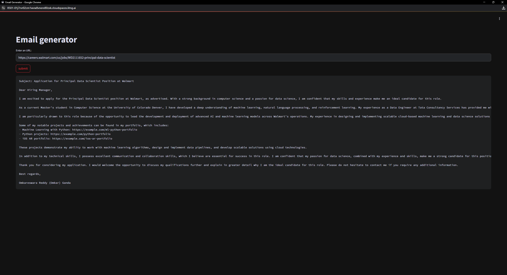

# 📧 End-to-End Mail Generator
End-to-End email generator for aspiring job seekers using groq, langchain and streamlit. It allows users to input the URL of a company's careers page. The tool then extracts job listings from that page and generates personalized cold emails. These emails include relevant portfolio links sourced from a vector database, based on the specific job descriptions. 

**Let's Consider a scenario:**

- Walmart needs a Dat Scientist and is spending time and resources in the hiring process, on boarding, training etc
- You, as an experienced Data Scientist can provide your expertise as an experience Data Scientist to Walmart. So, the experienced Data Sceintist (The user) is going to reach out to Walmart via a cold email.



## Architecture Diagram


## Set-up
1. To get started we first need to get an API_KEY from here: https://console.groq.com/keys. Inside `app/.env` update the value of `GROQ_API_KEY` with the API_KEY you created. 


2. To get started, first install the dependencies using:
    ```commandline
     pip install -r requirements.txt
    ```
   
3. Run the streamlit app:
   ```commandline
   streamlit run app/main.py
   ```
